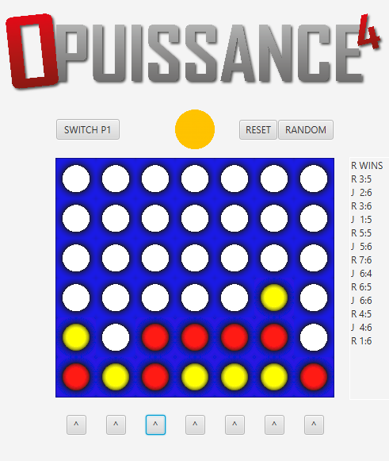

# ❄️ Puissance4

**Puissance 4** est une version du célébre jeu du meme nom.
Il permet la manipulation du modèle MVC et une première visualisation du modèle MVC. 

## 🚀 Fonctionnalités principales
- **Jouer une partie classique** : Jouer.
- **Changer le joueur 1** :  Passer du joueur 1 a 2 (Changer les jetons de couleur).
- **Graphismes élaboré** : une ambiance immersive grâce à des descriptions et des événements textuels qui plongent le joueur dans la période.

 
